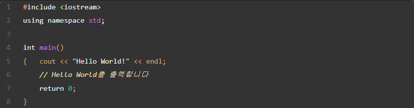
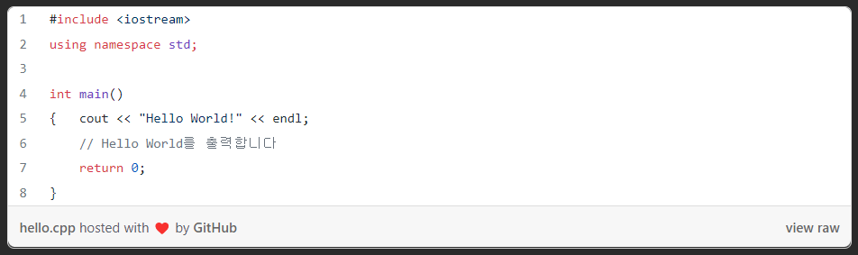

# Git gist / Git Blog Dark Theme
### Git gist 를 포함한 Git Blog에 적용되는 코드 블록을 다크모드로 설정합니다.
---

* 다크모드 설정
* "hosted by Github" 과 같은 meta 텍스트 삭제 ( `.gist-meta{display : none}` 를 사용합니다. 해당 코드를 삭제하면 다시 표시할 수 있습니다. )
* 가독성과 조화로운 Mint Color

#### 적용 모습

#### 기존 모습

#### 사용 방법은 블로그를 참고해 주세요🐸
[▶ Git Blog 적용 방법](https://jeongmint.github.io/posts/2022-04-26-page002)
